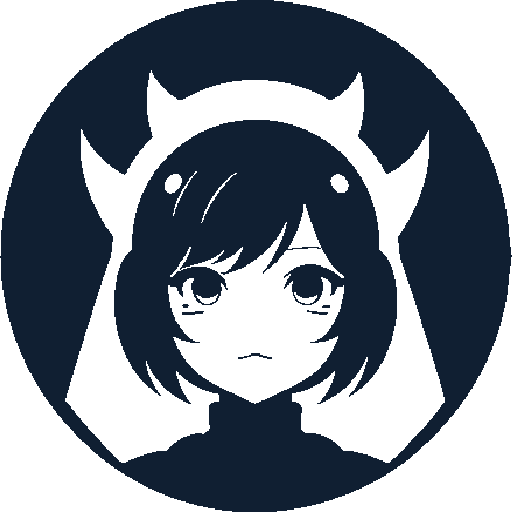

  

# KiraYume: Manga/Manhwa Image Translator

KiraYume is a user-friendly, feature-rich Qt application for translating text in manga/manhwa images. It uses Tesseract-OCR to extract text, Google or DeepL (API-less) for translation, and Pillow for image editing. **Currently in Beta**, with more features, fixes, and adjustments planned.

---

## Usage:
Add & select an image, make sure Tesseract-OCR is connected, choose languages & font if need be, then Scan the image.
Notice mistakes? use Area Scanner to re-scan the broken part of the image, and Text Eraser to remove text.

## Features:
* **Scan Image**: Scans & translates entire image in one go.
* **Area Scanner**: Select a region and scan only that portion for translation.
* **Text Eraser**: Erase unwanted text from a specific area in the image.
* **Customization**: Adjust translation languages, text fonts, text color, text background color, save location and various quality of life options in the settings menu.

## Installation:
[Download](https://github.com/Vyoxa/KiraYume/releases), Unzip, & Run, there are two options:

* **With Bundled Tesseract OCR**

Download & run right away, Tesseract-OCR will be connected automatically.

* **Without Tesseract OCR**

Already have [Tesseract-OCR](https://github.com/UB-Mannheim/tesseract/wiki) installed? Download KiraYume and link it to Tesseract-OCR by opening Tesseract Settings (bottom-left) and selecting tesseract.exe, click Reload, and enable your traineddata ocr files as needed.

> [**NOTE**]
> Download and add any additional needed tessdata files from [here](https://github.com/tesseract-ocr/tessdata), Make sure to add them in Tesseract-OCR\tessdata folder.
